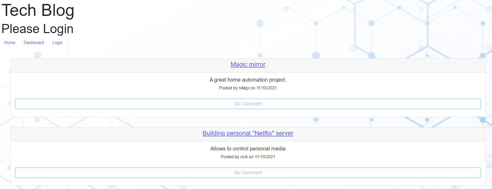
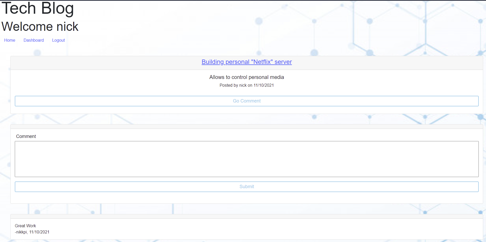
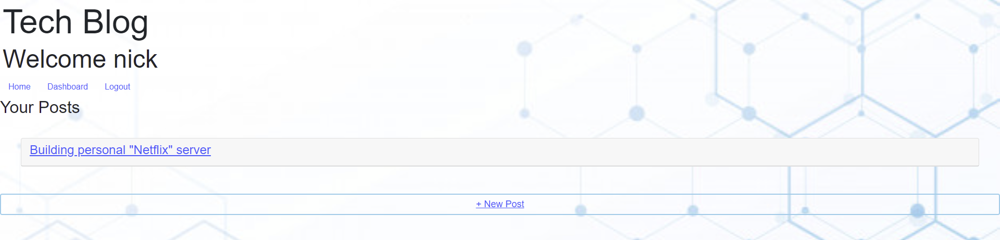

<h1 align="center">Tech Blog </h1>

  [](https://opensource.org/licenses/MIT) <br />

## Description
```md
AS A developer who writes about tech
I WANT a CMS-style blog site
SO THAT I can publish articles, blog posts, and my thoughts and opinions
```

## Table of Contents
  - [Description](#description)
  - [Installation](#installation)
  - [Usage](#usage)
  - [License](#license)
  - [Run](#run)
  - [Contributing](#contributing)
  - [Video Link](#video)  
  - [Image](#image)
  - [Deployed Link](#link)

## Installation
  
  This program can be run through a browser using the above link to the deployed application. Alternatively, to run this application locally you will need to:  

  - Clone this repository to receive all of the files (git clone https://github.com/nikhil-kharbanda/UofT_TechBlog.git)  
  - Set up your environment variables in a .env file  
  - Run "npm install" in the command line of your terminal to set up all of the dependencies  
  - Initialize your database by running the "schema.sql" file with MySQL  
  - Populate the existing database items by running "npm run seed" in your terminal  
  - Run "npm start" to start the application's connection  
  - Go to the url of the application (http//:localhost:3001) to begin using it  

## Purpose
  Purpose of this project is to have some practice with routing, as well as having the experience of becoming a full-stack developer

## Run
  run the application by using either npm run start, or npm run watch

## Contributing
  N/A

## Video
  N/A

## Image







## Link
https://uoft-techblog.herokuapp.com/

## About the developer 
  nikhil-kharbanda <br >
  nikhil_kharbanda@hotmail.com

  
